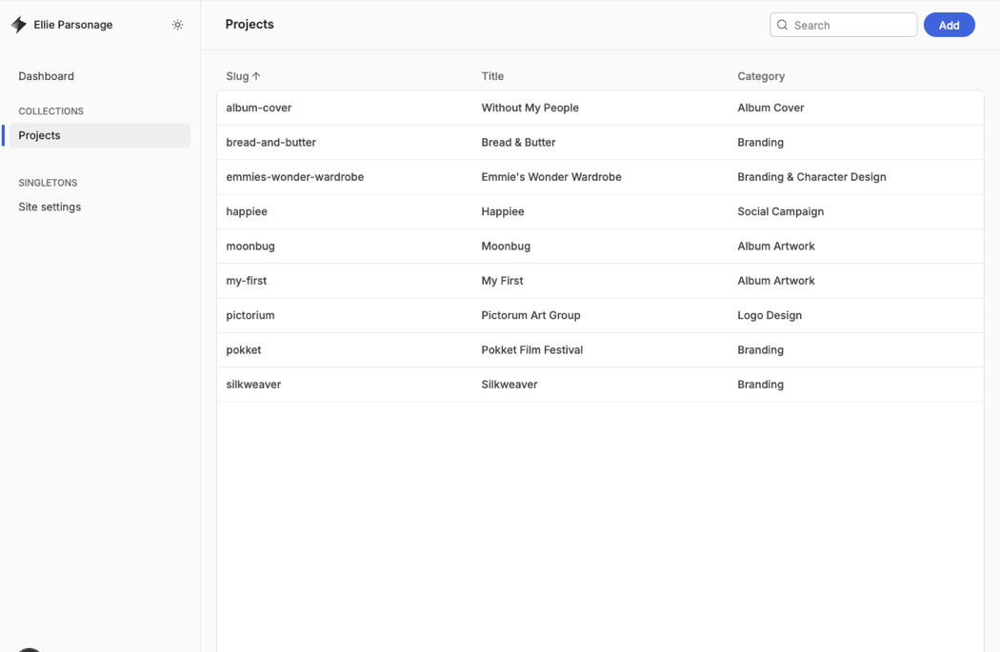
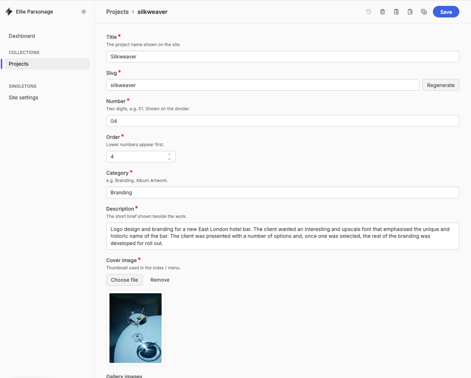

# Editing your site

Everything lives behind one screen at `ellieparsonagedesign.com/ellieadmin`. Sign in with GitHub. You'll find two areas: **Projects** (your work) and **Site settings** (your name, headline and contact).

Saved changes go live about a minute later. The site rebuilds itself, so if something isn't there straight away, give it a moment and refresh.

## Projects

Open a project to edit its **Project title**, **Category**, **Description**, **Number** (the big number shown when it opens) or **Position in the list** (lower shows first). Save when you're done.

The **Web link name** fills itself in from the title. Leave it be.

## Images

- **Cover image** is the thumbnail in your work menu.
- **Gallery images** are the shots people scroll through, top to bottom.

Add, replace, drag to reorder or delete, then Save. JPG or PNG; around 1600px wide keeps them sharp and quick to load.

## Adding or removing work

**Add** (top right) creates a new project: fill it in, upload images, Save. To remove one, open it and choose **Delete entry**.

## Homepage text and contact

**Site settings** holds your name, the two big words on the opening screen, your availability line and your contact email.
